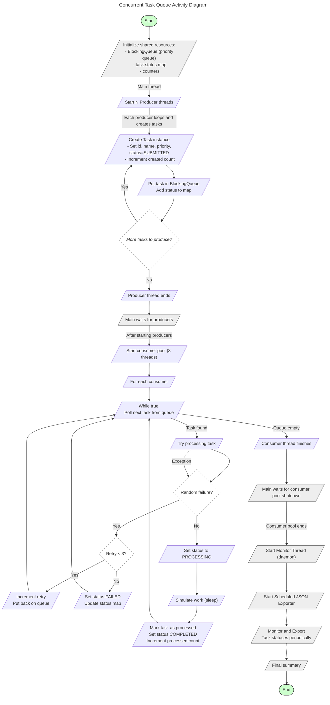
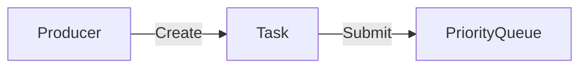
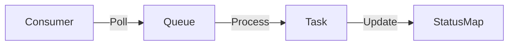

# 🚀 ConcurQueueLab

A multithreaded Java application demonstrating core **concurrency** concepts including **task production & consumption**, **thread monitoring**, **deadlock scenarios**, and **automated JSON export** of task statuses.

---

## 📘 Overview

**ConcurQueueLab** showcases:

- 🧵 Producer–Consumer pattern using `PriorityBlockingQueue`
- 🔁 Thread pool management & real-time monitoring
- 📊 Task lifecycle tracking with concurrent data structures
- ⚠️ Deadlock creation and prevention strategies
- 📤 Scheduled export of task status data to JSON
- 🧪 Custom metrics and thread pool analytics

---

## ✨ Features

- ✅ **Concurrent Task Processing** — Producers create tasks; Consumers process them in parallel
- 📌 **Priority Task Queue** — Tasks are ordered using `PriorityBlockingQueue`
- 📡 **Thread Pool Monitoring** — Real-time metrics via a dedicated logger thread
- 📈 **Task State Tracking** — Tracks lifecycle: `SUBMITTED`, `PROCESSING`, `COMPLETED`, `FAILED`
- 🗃️ **Periodic JSON Export** — Exports all task statuses every 1 minute
- 🔒 **Deadlock Simulation & Resolution** — Demonstrates how deadlocks occur and how to fix them

---




## 🗂️ Project Structure

```
ConcurQueueLab/
├── src/
│   └── main/java/org/example/novaTech/
│       ├── consumer/            # Task consumer implementations
│       ├── deadlock/            # Deadlock examples
│       ├── jsonExport/          # JSON export functionality
│       ├── model/               # Data models (Task)
│       ├── producer/            # Task producers
│       ├── threadMonitor/       # Monitoring system
│       ├── utils/               # Enums/helpers
│       └── ConcurQueueLab.java  # Main application
├── jsonExports/                 # Generated JSON files
└── pom.xml                      # Maven configuration
```

---

## 🛠️ Prerequisites

- Java **JDK 24** or newer
- Maven (for building and running)
- IDE like **IntelliJ IDEA** (recommended)
- [Lombok](https://projectlombok.org/) plugin (already included in dependencies)

---

## 📦 Dependencies

- [`Lombok`](https://projectlombok.org/) `v1.18.38` — Less boilerplate, cleaner code
- [`Jackson Databind`](https://github.com/FasterXML/jackson) `v2.19.0` — JSON export & formatting

---

## ▶️ Running the Application

### ✅ Option 1: Using Maven (Terminal)

1. **Clone the repo**
   ```bash
   git clone https://github.com/XzibiT-Collins/Task-Dispatch-System.git
   cd ConcurQueueLab
    ```
2. **Build the project**
   ```bash
    mvn clean package
    ```

3. **Run the project**
    ```bash
   mvn exec:java -Dexec.mainClass="org.example.ConcurQueueLab"
   ```

### ✅ Option 2: Using IntelliJ IDEA
```
1. **Open the project in IntelliJ**

2. **Ensure your Project SDK is set to Java 21+**

3. **Locate and run the main() method in ConcurQueueLab.java**
```

## 🔄 Application Flow

1. **Initialization**: Creates shared data structures (task queue, status map, counters)
2. **Producer Phase**: Starts 3 producer threads that create tasks with random priorities

3. **Consumer Phase**: Initializes a thread pool with 3 consumer threads to process tasks

4. **Monitoring**: Background thread monitors thread pool status and logs metrics
5. **Export**: Scheduled task exports task statuses to JSON files every minute
6. **Summary**: Displays final statistics including task counts and status breakdown

## ⚙️ Configuration

Key configuration parameters in `ConcurQueueLab.java`:
- `numberOfTasks`: Number of tasks per producer iteration (default: 10)
- Producer threads: 3 threads
- Consumer thread pool: 3 threads
- Queue capacity: 50 tasks
- Export interval: 1 minute

## Output

The application generates:
- **Console output**: Real-time logging and final summary statistics
- **JSON files**: Task status exports in the `jsonExports/` directory
- **Thread monitoring logs**: Performance metrics and thread pool status

## Example Demos

### Deadlock Demonstration
Run the deadlock examples to understand deadlock scenarios:
```bash
mvn exec:java -Dexec.mainClass="org.example.novaTech.deadlock.DeadLock"
mvn exec:java -Dexec.mainClass="org.example.novaTech.deadlock.DeadLockResolved"
```


